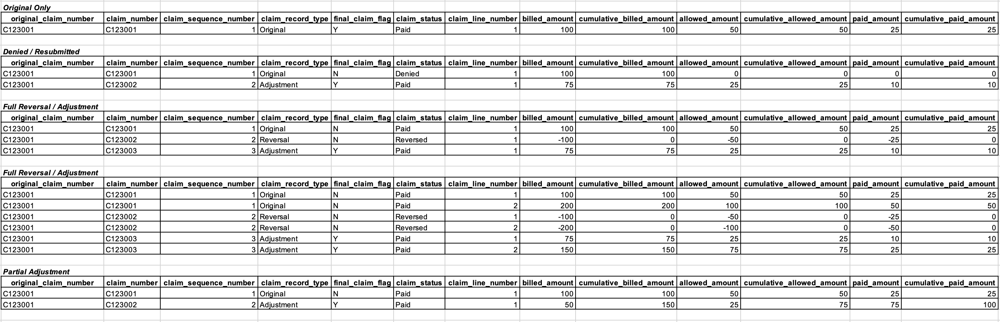

<p class="article-byline">By <a href="https://www.linkedin.com/in/aaronneiderhiser/" rel="noopener noreferrer" target="_blank">Aaron Neiderhiser</a><br><span class="article-byline-date">Last Updated: March 12, 2026</span></p>



One of the trickiest issues to deal with in claims data is adjustments, denials, and reversals (what we often refer to as "ADR"). There are three types of claim records (original, adjustment, and reversal) and three types of claim payment statuses (paid, denied, reversed). How you model claim record types and payment statuses will impact the analytics you're able to perform on your claims data.

Let's take a step back and think about the types of analytics we perform on claims data. At the highest level, we think there are two categories of claims analytics:

1. Cashflow analytics
2. Population health analytics

Cashflow analytics includes analyses like calculating Incurred But Not Reported (IBNR) claims. This sort of calculation is done by an actuary to measure and manage cash reserves for an insurance company or health plan. To perform this type of analysis you need to see every iteration of a claim that occurred. For example, if a claim was originally paid, then reversed and adjusted weeks later, you need to have full visibility into these payments and the dates when the payments occurred. Leveraging multiple iterations of a claim is also useful for the analytics team when it's necessary to align analytics with financial reporting, or when it's necessary to understand when a claim was first received or processed (the original claim received or paid date).

Population health analytics includes analyses around the cost of care, diagnosis and treatment, utilization, and risk of a patient population. This type of analysis is more concerned with the final amounts paid (rather than intermediate adjustments and reversals) and the dates when services were delivered (as opposed to paid dates).

The trick is to model your claims data in such a way that supports both types of analyses, satisfying your cashflow analysis folks (e.g. actuaries and financial analysts) and your population health analysis folks (e.g. quality measures folks, data scientists, epidemiologists, also actuaries here too, etc.). This involves keeping the multiple iterations of the claim available for cashflow analytics while allowing population health and other analytics use cases to only worry about the final disposition, which we'll detail below.

Let's quickly define the three different types of claim records:

- **Original:** This claim record type is the first (and sometimes only) claim submitted.
- **Adjustment:** This claim record type is submitted if the original claim was denied or if the provider found an issue with the original claim they needed to correct.
- **Reversals:** This claim record type is submitted if the original claim was paid, but then an adjustment was needed and the original claim needed to be backed out.

The three types of payment statuses are straightforward:

- **Paid:** Indicates the claim was paid (positive paid amount)
- **Denied:** Indicates the claim was denied (zero paid amount)
- **Reversed:** Indicates the claim is reversed (negative paid amount)

## Modeling ADR

It's easiest to illustrate how adjustments, denials, and reversals manifest by looking at example scenarios. By looking at examples we can also see how to model ADR claims to support both cash flow and population health analytics.


Let's walk through each scenario in the image above. As we do, pay careful attention to how the cumulative amounts change from the original claim, to the reversal, to the adjustment claim. Modeling the amounts this way is what enables both cashflow and population health analytics.

### Scenario 1: Original Only

This first scenario is the simplest. There's only a single claim, with a single claim line, and it's the original claim (see claim_record_type) as you would expect. This claim has been paid (see claim_status). The billed, allowed, and paid amounts for this claim are equal to the cumulative amounts. You'll see how these individual and cumulative claims differ in subsequent scenarios.

### Scenario 2: Denied / Re-submitted

In the second scenario, the original claim was denied (see claim_status), so an adjustment claim was submitted and adjudicated. The original claim could have been denied for any number of reasons. The billed amount on the original claim was $100 and the allowed and paid amounts were $0 (no payment was allowed since the claim was denied).

The billed, allowed, and paid amounts on the second claim (the adjustment claim) were $75, $25, and $10, respectively. Now pay attention to the cumulative billed, allowed, and paid amount columns. These columns sum up the current and previous claim billed, allowed, and paid amounts.

There's one unusual thing about cumulative_billed_amount in this scenario. For denied claims, you don't add the billed_amount to cumulative_billed_amount total. Doing so would screw up the billed-to-allowed ratio of the cumulative_billed_amount and cumulative_allowed_amount fields.

Note that the adjustment claim gets a new claim_number and we associate this claim ID with the original claim via original_claim_number.

### Scenario 3: Full Reversal / Adjustment

In this scenario, the original claim was completely reversed and then an adjustment claim was subsequently submitted. The cumulative billed, allowed, and paid amounts match the billed, allowed, and paid amounts from the final adjustment claim because the reversal claim negated all the amounts from the original claim.

### Scenario 4: Full Reversal / Adjustment (w/ multiple lines)

This scenario is similar to the third scenario but provides an example of how a full reversal and adjustment will look with multiple claim lines. Note that cumulative amounts are tracked at the line level.

### Scenario 5: Partial Adjustment

This final example shows how a claim may be partially adjusted, with an additional positive or sometimes negative payment amount.

## How to Identify ADRs

**The number one thing you can do is ask the insurance company or health plan how to identify ADRs in the claims dataset. If they can't tell you, that's a bad sign (but unfortunately this happens a lot). In that case see below.**

The exact manner in which claims adjustments and reversals manifest in your claims dataset may not be obvious or easy to identify. However, they typically show up in 1 of 3 ways, depending on how the health insurer adjudicates their claims.

- **Scenario 1:** Health insurer creates a new claim ID for each additional reversal and/or adjustment claim record
- **Scenario 2:** Health insurer uses the original claim ID for each reversal and/or adjustment claim, but includes an adjustment/reversal code on each claim to indicate whether each new record was a reversal or adjustment
- **Scenario 3:** Health insurer uses a combination of old and new claim IDs for reversals and/or adjustments (this is essentially a combination of scenario 1 and 2)

In our experience working across dozens of healthcare claims datasets, each scenario is equally common.

Before splitting into each scenario, run this baseline profile to get a quick ADR signal in `input_layer.medical_claim`.

<details>
<summary><strong>Show/hide SQL query: baseline ADR signal check</strong></summary>

```sql
with claim_line_rollup as (
    select
        data_source,
        claim_id,
        coalesce(claim_line_number, 0) as claim_line_number,
        count(*) as row_count,
        sum(case when paid_amount > 0 then 1 else 0 end) as paid_rows,
        sum(case when paid_amount = 0 then 1 else 0 end) as denied_rows,
        sum(case when paid_amount < 0 then 1 else 0 end) as reversed_rows,
        count(distinct coalesce(paid_amount, -99999999.99)) as distinct_paid_amounts,
        sum(coalesce(paid_amount, 0.0)) as net_paid_amount
    from input_layer.medical_claim
    group by 1, 2, 3
)

select
    data_source,
    count(*) as claim_line_groups,
    sum(case when row_count > 1 then 1 else 0 end) as groups_with_multiple_rows,
    sum(case when reversed_rows > 0 then 1 else 0 end) as groups_with_reversal_like_rows,
    sum(case when denied_rows > 0 then 1 else 0 end) as groups_with_denied_like_rows,
    sum(case when distinct_paid_amounts > 1 then 1 else 0 end) as groups_with_paid_amount_changes,
    round(sum(net_paid_amount), 2) as net_paid_amount
from claim_line_rollup
group by 1
order by 1;
```

</details>

### Scenario 1: New Claim IDs for Each Adjustment/Reversal

Dealing with new claim IDs is the most difficult scenario because you are in effect trying to determine a linkage across claim IDs when there isn't a piece of data that tells you this. That is, you need to identify new claim IDs that are related to the original claim ID. This can be tricky, but here are some steps you can follow to do this:

1. Start by looking for patients with multiple claims (i.e. multiple claim IDs).
2. To identify reversals, look for claims where all the data elements match, except the paid amount and the paid date.
3. To identify adjustments, look for claims that have a reversal, then look for subsequent claims where most of the information is the same but there may be minor differences (e.g. place of service code changed from 11 to 20).

This first query looks for likely reversal pairs where two different claim IDs have equal and opposite paid amounts for the same person and matching claim-line service fingerprints.

<details>
<summary><strong>Show/hide SQL query: scenario 1 reversal pairs (new claim IDs)</strong></summary>

```sql
with normalized_claims as (
    select
        data_source,
        person_id,
        claim_id,
        coalesce(claim_line_number, 0) as claim_line_number,
        coalesce(claim_line_start_date, claim_start_date) as line_start_date,
        coalesce(claim_line_end_date, claim_end_date) as line_end_date,
        coalesce(place_of_service_code, '') as place_of_service_code,
        coalesce(bill_type_code, '') as bill_type_code,
        coalesce(revenue_center_code, '') as revenue_center_code,
        coalesce(hcpcs_code, '') as hcpcs_code,
        paid_date,
        coalesce(paid_amount, 0.0) as paid_amount
    from input_layer.medical_claim
    where person_id is not null
),

potential_reversal_pairs as (
    select distinct
        a.data_source,
        a.person_id,
        a.claim_id as original_claim_id,
        b.claim_id as reversal_claim_id,
        a.claim_line_number,
        a.line_start_date,
        a.line_end_date,
        a.place_of_service_code,
        a.bill_type_code,
        a.revenue_center_code,
        a.hcpcs_code,
        a.paid_amount as original_paid_amount,
        b.paid_amount as reversal_paid_amount,
        a.paid_date as original_paid_date,
        b.paid_date as reversal_paid_date
    from normalized_claims a
    inner join normalized_claims b
        on a.data_source = b.data_source
       and a.person_id = b.person_id
       and a.claim_line_number = b.claim_line_number
       and coalesce(a.line_start_date, date '1900-01-01') = coalesce(b.line_start_date, date '1900-01-01')
       and coalesce(a.line_end_date, date '1900-01-01') = coalesce(b.line_end_date, date '1900-01-01')
       and a.place_of_service_code = b.place_of_service_code
       and a.bill_type_code = b.bill_type_code
       and a.revenue_center_code = b.revenue_center_code
       and a.hcpcs_code = b.hcpcs_code
       and a.claim_id <> b.claim_id
       and a.paid_amount > 0
       and b.paid_amount < 0
       and round(a.paid_amount + b.paid_amount, 2) = 0
)

select
    data_source,
    count(*) as matched_line_pairs,
    count(distinct original_claim_id) as original_claim_ids,
    count(distinct reversal_claim_id) as reversal_claim_ids
from potential_reversal_pairs
group by 1
order by 1;
```

</details>

This next query extends the same pattern to look for a potential third claim ID (a likely adjustment) after the reversal.

<details>
<summary><strong>Show/hide SQL query: scenario 1 adjustment after reversal (new claim IDs)</strong></summary>

```sql
with normalized_claims as (
    select
        data_source,
        person_id,
        claim_id,
        coalesce(claim_line_number, 0) as claim_line_number,
        coalesce(claim_line_start_date, claim_start_date) as line_start_date,
        coalesce(claim_line_end_date, claim_end_date) as line_end_date,
        coalesce(place_of_service_code, '') as place_of_service_code,
        coalesce(bill_type_code, '') as bill_type_code,
        coalesce(revenue_center_code, '') as revenue_center_code,
        coalesce(hcpcs_code, '') as hcpcs_code,
        paid_date,
        coalesce(paid_amount, 0.0) as paid_amount
    from input_layer.medical_claim
    where person_id is not null
),

reversal_pairs as (
    select distinct
        a.data_source,
        a.person_id,
        a.claim_id as original_claim_id,
        b.claim_id as reversal_claim_id,
        a.claim_line_number,
        a.line_start_date,
        a.line_end_date,
        a.place_of_service_code,
        a.bill_type_code,
        a.revenue_center_code,
        a.hcpcs_code,
        b.paid_date as reversal_paid_date
    from normalized_claims a
    inner join normalized_claims b
        on a.data_source = b.data_source
       and a.person_id = b.person_id
       and a.claim_line_number = b.claim_line_number
       and coalesce(a.line_start_date, date '1900-01-01') = coalesce(b.line_start_date, date '1900-01-01')
       and coalesce(a.line_end_date, date '1900-01-01') = coalesce(b.line_end_date, date '1900-01-01')
       and a.place_of_service_code = b.place_of_service_code
       and a.bill_type_code = b.bill_type_code
       and a.revenue_center_code = b.revenue_center_code
       and a.hcpcs_code = b.hcpcs_code
       and a.claim_id <> b.claim_id
       and a.paid_amount > 0
       and b.paid_amount < 0
       and round(a.paid_amount + b.paid_amount, 2) = 0
),

potential_adjustments as (
    select distinct
        rp.data_source,
        rp.person_id,
        rp.original_claim_id,
        rp.reversal_claim_id,
        c.claim_id as adjustment_claim_id,
        rp.claim_line_number,
        rp.line_start_date,
        rp.line_end_date,
        c.paid_date as adjustment_paid_date,
        c.paid_amount as adjustment_paid_amount
    from reversal_pairs rp
    inner join normalized_claims c
        on rp.data_source = c.data_source
       and rp.person_id = c.person_id
       and rp.claim_line_number = c.claim_line_number
       and coalesce(rp.line_start_date, date '1900-01-01') = coalesce(c.line_start_date, date '1900-01-01')
       and coalesce(rp.line_end_date, date '1900-01-01') = coalesce(c.line_end_date, date '1900-01-01')
       and rp.place_of_service_code = c.place_of_service_code
       and rp.bill_type_code = c.bill_type_code
       and rp.revenue_center_code = c.revenue_center_code
       and rp.hcpcs_code = c.hcpcs_code
       and c.claim_id not in (rp.original_claim_id, rp.reversal_claim_id)
       and c.paid_amount > 0
       and (
            rp.reversal_paid_date is null
            or c.paid_date is null
            or c.paid_date >= rp.reversal_paid_date
       )
)

select
    data_source,
    count(*) as candidate_adjustment_lines,
    count(distinct adjustment_claim_id) as candidate_adjustment_claim_ids
from potential_adjustments
group by 1
order by 1;
```

</details>

### Scenario 2: Original Claim IDs for Each Adjustment/Reversal

This is the simplest scenario. The payer / health plan has already done the bulk of the work for you, explicitly telling you which claims were adjusted / reversed and whether the claim was paid or denied. However in practice this information is usually not completely available, so like most things in healthcare data there tends to be a bit of detective work to fill in the gaps.

If your source keeps the same `claim_id`, this query finds claim lines with multiple versions and flags where payment behavior changed across versions.

<details>
<summary><strong>Show/hide SQL query: scenario 2 repeated claim IDs</strong></summary>

```sql
with claim_id_versions as (
    select
        data_source,
        claim_id,
        coalesce(claim_line_number, 0) as claim_line_number,
        count(*) as row_count,
        count(distinct coalesce(paid_amount, -99999999.99)) as distinct_paid_amounts,
        sum(case when paid_amount > 0 then 1 else 0 end) as paid_rows,
        sum(case when paid_amount = 0 then 1 else 0 end) as denied_rows,
        sum(case when paid_amount < 0 then 1 else 0 end) as reversed_rows,
        min(paid_date) as first_paid_date,
        max(paid_date) as last_paid_date,
        round(sum(coalesce(paid_amount, 0.0)), 2) as net_paid_amount
    from input_layer.medical_claim
    group by 1, 2, 3
)

select
    data_source,
    claim_id,
    claim_line_number,
    row_count,
    distinct_paid_amounts,
    paid_rows,
    denied_rows,
    reversed_rows,
    first_paid_date,
    last_paid_date,
    net_paid_amount
from claim_id_versions
where row_count > 1
  and (
      distinct_paid_amounts > 1
      or denied_rows > 0
      or reversed_rows > 0
  )
order by row_count desc, distinct_paid_amounts desc, claim_id, claim_line_number
limit 100;
```

</details>

Once you have repeated claim IDs, this query infers record type (`original` vs `adjustment`) and claim status (`paid`, `denied`, `reversed`) over time so you can validate cumulative paid behavior.

<details>
<summary><strong>Show/hide SQL query: scenario 2 inferred claim timeline</strong></summary>

```sql
with ordered_versions as (
    select
        data_source,
        claim_id,
        coalesce(claim_line_number, 0) as claim_line_number,
        paid_date,
        file_date,
        ingest_datetime,
        coalesce(paid_amount, 0.0) as paid_amount,
        row_number() over (
            partition by data_source, claim_id, coalesce(claim_line_number, 0)
            order by
                coalesce(paid_date, date '1900-01-01'),
                coalesce(file_date, date '1900-01-01'),
                coalesce(ingest_datetime, timestamp '1900-01-01 00:00:00')
        ) as version_number
    from input_layer.medical_claim
),

versioned_claims as (
    select
        data_source,
        claim_id,
        claim_line_number,
        version_number,
        paid_date,
        file_date,
        paid_amount,
        case
            when paid_amount < 0 then 'reversed'
            when paid_amount = 0 then 'denied'
            else 'paid'
        end as inferred_claim_status,
        case
            when version_number = 1 then 'original'
            else 'adjustment'
        end as inferred_claim_record_type,
        sum(paid_amount) over (
            partition by data_source, claim_id, claim_line_number
            order by version_number
            rows between unbounded preceding and current row
        ) as cumulative_paid_amount,
        count(*) over (
            partition by data_source, claim_id, claim_line_number
        ) as version_count
    from ordered_versions
)

select
    data_source,
    claim_id,
    claim_line_number,
    version_number,
    inferred_claim_record_type,
    inferred_claim_status,
    paid_date,
    file_date,
    paid_amount,
    round(cumulative_paid_amount, 2) as cumulative_paid_amount
from versioned_claims
where version_count > 1
order by data_source, claim_id, claim_line_number, version_number
limit 200;
```

</details>

### Scenario 3: Combination New and Original Claim IDs for Each Adjustment/Reversal

Sometimes adjustments and reversals will appear as new claim IDs, but these claim IDs will include the original claim ID plus some additional characters. For example:

- original claim ID: A1234
- adjustment claims ID: A12341
- reversal claim ID: A12342

In this example you can see the subsequent claims have an integer appended to them.

This query looks for claim IDs that appear to be derived from an original claim ID (prefix matching) for the same person and same line-level service fingerprint.

<details>
<summary><strong>Show/hide SQL query: scenario 3 prefix-based claim ID matching</strong></summary>

```sql
with claim_lines as (
    select distinct
        data_source,
        person_id,
        claim_id,
        coalesce(claim_line_number, 0) as claim_line_number,
        coalesce(claim_line_start_date, claim_start_date) as line_start_date,
        coalesce(claim_line_end_date, claim_end_date) as line_end_date,
        coalesce(paid_amount, 0.0) as paid_amount,
        paid_date
    from input_layer.medical_claim
    where person_id is not null
      and claim_id is not null
),

prefix_links as (
    select distinct
        base.data_source,
        base.person_id,
        base.claim_id as original_claim_id,
        child.claim_id as derived_claim_id,
        base.claim_line_number,
        base.line_start_date,
        base.line_end_date,
        base.paid_amount as original_paid_amount,
        child.paid_amount as derived_paid_amount,
        base.paid_date as original_paid_date,
        child.paid_date as derived_paid_date
    from claim_lines base
    inner join claim_lines child
        on base.data_source = child.data_source
       and base.person_id = child.person_id
       and base.claim_line_number = child.claim_line_number
       and coalesce(base.line_start_date, date '1900-01-01') = coalesce(child.line_start_date, date '1900-01-01')
       and coalesce(base.line_end_date, date '1900-01-01') = coalesce(child.line_end_date, date '1900-01-01')
       and child.claim_id like base.claim_id || '%'
       and child.claim_id <> base.claim_id
       and length(child.claim_id) > length(base.claim_id)
       and length(child.claim_id) <= length(base.claim_id) + 3
)

select
    data_source,
    count(*) as linked_claim_line_pairs,
    count(distinct original_claim_id) as original_claim_ids,
    count(distinct derived_claim_id) as derived_claim_ids
from prefix_links
group by 1
order by 1;
```

</details>

## Real-world Impacts of ADRs

In an ideal world, all population health analytics should be based on a claims dataset that represents the true set of services rendered by the provider to the patient and payments rendered by the health insurer to the provider. However, unless you account and correct for claims adjustments and reversals in raw claims data, you are including records in your analysis for services that may never have been delivered. The problem with downstream analytics is much more on the utilization side than on the payments side.

**Payments**

Let's start by exploring the impact on payments first, since it is minimal and more straightforward. At the end of the day, claims adjustments and reversals will directly flow through to aggregate payment amounts (e.g. payments aggregated to PMPM level), generating the true/correct payment statistics. For example, if a claim was submitted in error and then later a reversal was submitted, the sum of the paid amount for these two claims will be zero, which is the true paid amount we would expect. As this example demonstrates, the aggregate payment amounts in any analysis (e.g. trending total medical PMPM by month) will be correct by default, without any changes made to the raw claims data. Therefore, it's not usually necessary to identify and correct adjustments, reversals, or denials before calculating payment statistics.

**Utilization**

However, the impact on utilization analytics is not as straightforward. In the simple example above we noticed that the place of service code changed from 11 (office visit) to 20 (urgent care). Place of service code is an important piece of information used to group claims into encounters. Without taking into account that a reversal and adjustment was made for this claim, it looks like two place of service codes exist for the same visit, and we are unsure which code to use to assign an encounter type to the claim (i.e. should the claim be labeled an office visit or urgent care visit).

This has serious consequences for utilization analytics and also impacts payment analytics if we want to analyze payments by care setting. For example, suppose we are interested in looking at spend across different care settings, e.g. acute inpatient, inpatient rehab, emergency department, urgent care, and office visit. Without properly identifying and correcting claims adjustments and reversals we won't be able to bucket spend or number of visits in the appropriate category.
