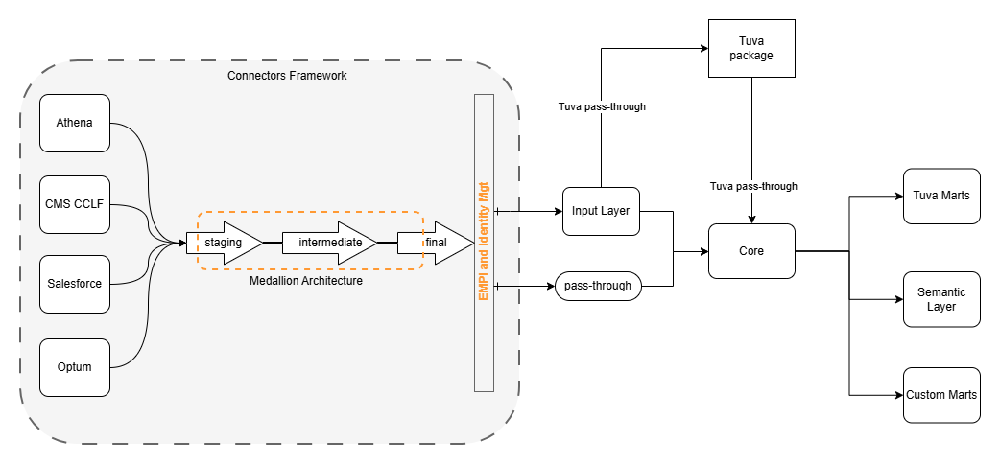
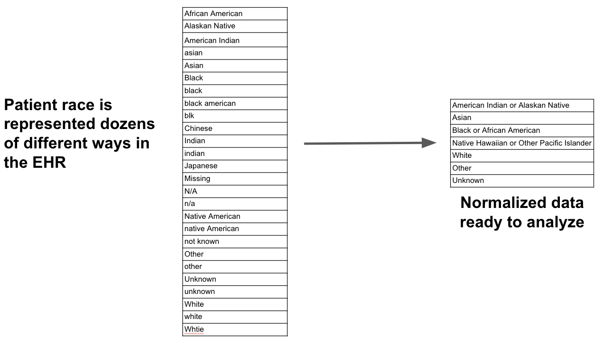

<section class="landing-shell">

<article class="article-card" data-search="Understanding Medicare ACO Assignment In Medicare ACOs member assignment is complex -- but it doesn't have to be. Mike Krahulec">
<a href="https://www.thetuvaproject.com/blog/understanding-medicare-aco-assignment" class="article-card-link">

<h3>Understanding Medicare ACO Assignment</h3>

Mike Krahulec

February 19, 2026

In Medicare ACOs member assignment is complex -- but it doesn't have to be.

Read Article

</a>
</article>

<article class="article-card" data-search="Customizing the Tuva Data Model How Tuva v0.17.0 preserves custom extension columns across the core data model with a configurable prefix-based pass-through pattern. Rabee Zyoud">
<a href="https://www.thetuvaproject.com/blog/customizing-the-tuva-data-model" class="article-card-link">

<h3>Customizing the Tuva Data Model</h3>

Rabee Zyoud

February 12, 2026

How Tuva v0.17.0 preserves custom extension columns across the core data model with a configurable prefix-based pass-through pattern.

Read Article

</a>
</article>

<article class="article-card" data-search="Building a Claims Data Platform A practical architecture guide for building claims analytics platforms, covering ingestion, normalization, data quality, adjustment handling, and analytics-ready models. It outlines implementation tradeoffs and concrete design decisions for scaling payer and value-based care use cases. Aaron Neiderhiser">
<a href="https://www.thetuvaproject.com/blog/building-a-claims-data-platform" class="article-card-link">

<h3>Building a Claims Data Platform</h3>

Aaron Neiderhiser

April 17, 2024

A practical architecture guide for building claims analytics platforms, covering ingestion, normalization, data quality, adjustment handling, and analytics-ready models. It outlines implementation tradeoffs and concrete design decisions for scaling payer and value-based care use cases.

Read Article

</a>
</article>

<article class="article-card" data-search="Intro to dbt for Healthcare An implementation-oriented introduction to dbt for healthcare data teams, focused on project structure, warehouse execution, Git workflows, and built-in testing/documentation. The post explains why these software engineering patterns materially improve analytics reliability and delivery speed. Aaron Neiderhiser">
<a href="https://www.thetuvaproject.com/blog/intro-dbt-for-healthcare" class="article-card-link">

<h3>Intro to dbt for Healthcare</h3>

Aaron Neiderhiser

January 31, 2024

An implementation-oriented introduction to dbt for healthcare data teams, focused on project structure, warehouse execution, Git workflows, and built-in testing/documentation. The post explains why these software engineering patterns materially improve analytics reliability and delivery speed.

Read Article

</a>
</article>

<article class="article-card" data-search="The Problem with Healthcare Data A technical breakdown of the three core barriers to reliable healthcare analytics: normalization, data quality, and high-level concept generation. It frames why these issues persist across claims and clinical data and why they must be addressed in the data model itself. Aaron Neiderhiser">
<a href="https://www.thetuvaproject.com/blog/the-problem-with-healthcare-data" class="article-card-link">

<h3>The Problem with Healthcare Data</h3>

Aaron Neiderhiser

January 11, 2024

A technical breakdown of the three core barriers to reliable healthcare analytics: normalization, data quality, and high-level concept generation. It frames why these issues persist across claims and clinical data and why they must be addressed in the data model itself.

Read Article

</a>
</article>

No matching articles. Try a broader keyword.

</section>

