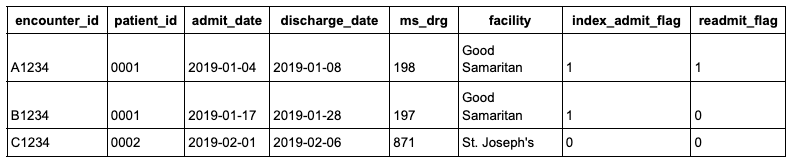

<p class="article-byline">By <a href="https://www.linkedin.com/in/aaronneiderhiser/" rel="noopener noreferrer" target="_blank">Aaron Neiderhiser</a> and <a href="https://www.linkedin.com/in/andreasmartinson/" rel="noopener noreferrer" target="_blank">Andreas Martinson</a><br><span class="article-byline-date">Last Updated: March 4, 2026</span></p>



The Tuva Project defines an encounter as a distinct healthcare visit in a distinct care setting. For example, if a patient goes to the hospital, is admitted, and later discharged, this is considered a single encounter, regardless of the number of claims associated with the encounter.

Merging claims into encounters is a detailed and sometimes messy process. A common edge case that comes up frequently in discussions of how encounter grouping works is same-day readmits: situations where a patient is discharged and returns to the same hospital on the same day.

By our definition of encounters, these readmits should be distinct encounters (not merged), but it does raise some interesting questions:

- How often do same-day readmits happen?
- Where are patients being readmitted from (Home, Home Health, SNF/Rehab, Another Facility, etc.)?
- What percent of same-day readmits have the same primary diagnosis?

In this article, we look at these questions using real-world and synthetic claims datasets. The datasets we use include:

- Tuva Synthetic: internally developed synthetic claims data based on real Medicare FFS claims
- CMS Synthetic: CMS synthetic claims data (frankly, not a realistic dataset)
- Medicare LDS: a 5% national sample of actual Medicare FFS claims from 2022-2023
- Anonymous Claims Datasets: real claims datasets from various organizations

## Defining Same-Day Readmits

For this analysis:

- Index encounter type is limited to `acute inpatient`.
- The index encounter must have a non-null discharge date (`encounter_end_date`).
- A same-day readmit is flagged when another qualifying encounter for the same patient has `encounter_start_date = index discharge_date` and both encounters occur at the same facility for the same type of encounter.

## Q: How Often Do Same-Day Readmits Occur?

To answer this, we ran the same query across multiple claims datasets mapped to the Tuva data model.  The query enforces all criteria mentioned above: same patient, same encounter type, same facility (`facility_id`), and same-day return (`encounter_start_date = index discharge_date`).

<details>
<summary><strong>Show/hide SQL query</strong></summary>

```sql
-- Same-day readmits using:
-- same patient + acute inpatient + same facility_id + readmit start = index end
-- No NULL facility_id matching.

with index_encounters as (
select
  e.encounter_id,
  e.person_id,
  e.encounter_end_date as discharge_date,
  e.facility_id,
  e.data_source
from core.encounter e
where e.encounter_type = 'acute inpatient'
  and e.encounter_end_date is not null
  and e.facility_id is not null
),

same_day_matches as (
select distinct
  idx.encounter_id
from index_encounters idx
inner join core.encounter r
    on r.person_id = idx.person_id
    and r.encounter_id <> idx.encounter_id
    and r.encounter_type = 'acute inpatient'
    and r.encounter_start_date = idx.discharge_date
    and r.facility_id = idx.facility_id
)

select
  data_source,
  count(*) as acute_inpatient_total,
  count_if(m.encounter_id is not null) as acute_inpatient_readmits,
  round(
        100.0
        * count_if(m.encounter_id is not null)
        / nullif(count(*), 0),
        2
  ) as acute_inpatient_pct_readmit
from index_encounters idx
left join same_day_matches m
    on idx.encounter_id = m.encounter_id
group by 1;
```

</details>

```{=html}
<style>
.readmit-results-shell {
  border: 1px solid #d6e1eb;
  border-radius: 14px;
  overflow: hidden;
  box-shadow: 0 10px 26px rgba(16, 38, 56, 0.08);
  margin: 0.5rem 0 1.1rem;
}

.readmit-results-table {
  width: 100%;
  border-collapse: separate;
  border-spacing: 0;
  font-size: 0.95rem;
}

.readmit-results-table thead tr:first-child th {
  background: #163850;
  color: #ffffff;
  font-weight: 700;
  border-right: 1px solid rgba(255, 255, 255, 0.18);
  text-align: center;
  padding: 0.72rem 0.8rem;
}

.readmit-results-table thead tr:nth-child(2) th {
  background: #2f5875;
  color: #ffffff;
  font-weight: 600;
  border-right: 1px solid rgba(255, 255, 255, 0.2);
  text-align: center;
  padding: 0.56rem 0.75rem;
}

.readmit-results-table thead th:first-child {
  text-align: left;
  min-width: 180px;
}

.readmit-results-table tbody td {
  border-bottom: 1px solid #e5edf4;
  padding: 0.56rem 0.72rem;
}

.readmit-results-table tbody tr:nth-child(odd) {
  background: #f7fafc;
}

.readmit-results-table td.label {
  font-weight: 600;
  color: #183347;
}

.readmit-results-table td.value {
  text-align: right;
  font-variant-numeric: tabular-nums;
}

.readmit-results-table thead th:last-child,
.readmit-results-table tbody td:last-child {
  border-right: 0;
}
</style>

<div class="readmit-results-shell table-responsive">
  <table class="readmit-results-table">
    <thead>
      <tr>
        <th>Data Source</th>
        <th>Total Acute IP Visits</th>
        <th>Same-Day Readmit</th>
        <th>% Readmit</th>
      </tr>
    </thead>
    <tbody>
      <tr><td class="label">Tuva Synthetic</td><td class="value">433</td><td class="value">1</td><td class="value">0.23</td></tr>
      <tr><td class="label">CMS Synthetic</td><td class="value">3,945</td><td class="value">492</td><td class="value">12.47</td></tr>
      <tr><td class="label">Medicare LDS</td><td class="value">701,115</td><td class="value">2,002</td><td class="value">0.29</td></tr>
      <tr><td class="label">Dataset A</td><td class="value">412</td><td class="value">1</td><td class="value">0.24</td></tr>
      <tr><td class="label">Dataset B</td><td class="value">224</td><td class="value">1</td><td class="value">0.45</td></tr>
      <tr><td class="label">Dataset C</td><td class="value">15</td><td class="value">0</td><td class="value">0</td></tr>
      <tr><td class="label">Dataset D</td><td class="value">84,765</td><td class="value">0</td><td class="value">0</td></tr>
      <tr><td class="label">Dataset E</td><td class="value">1,068</td><td class="value">0</td><td class="value">0</td></tr>
    </tbody>
  </table>
</div>
```

Same-day readmits are generally uncommon under this strict definition (same patient, same encounter type, same facility, same day).

This result is directionally what we would expect: patients are typically discharged when clinically ready, so returning to the same facility on the same day for the same encounter type should be rare.

CMS Synthetic is the only clear outlier with a materially higher acute inpatient readmit rate, which likely indicates the dataset is not realistic.

These results provide a useful benchmark for what a realistic same-day readmit measure should look like and offer a practical touchpoint for data quality review.

## Q: Where are Patients Being Readmitted From?

To answer this, we bucketed discharge dispositions into seven categories and measured same-day readmits within each bucket.

<details>
<summary><strong>Show/hide SQL query</strong></summary>

```sql
with
index_encounters as (
    select
        e.encounter_id,
        e.person_id,
        e.data_source,
        e.encounter_type,
        e.encounter_end_date as discharge_date,
        e.facility_id,
        e.discharge_disposition_code,
        e.discharge_disposition_description,
        case
            when e.discharge_disposition_code in ('01')
                 or lower(coalesce(e.discharge_disposition_description, '')) like '%home/self-care%'
                 or lower(coalesce(e.discharge_disposition_description, '')) like '%home self care%'
            then 'Home'
            when e.discharge_disposition_code in ('06')
                 or lower(coalesce(e.discharge_disposition_description, '')) like '%home health%'
            then 'Home Health'
            when e.discharge_disposition_code in ('03', '61', '62', '63', '64')
                 or lower(coalesce(e.discharge_disposition_description, '')) like '%skilled nursing%'
                 or lower(coalesce(e.discharge_disposition_description, '')) like '%rehabilitation%'
                 or lower(coalesce(e.discharge_disposition_description, '')) like '%rehab%'
            then 'SNF / Rehab'
            when e.discharge_disposition_code in ('02', '04', '05', '43', '65', '66', '69', '70')
                 or lower(coalesce(e.discharge_disposition_description, '')) like '%transferred%'
            then 'Another Facility'
            when e.discharge_disposition_code in ('30')
                 or lower(coalesce(e.discharge_disposition_description, '')) like '%still patient%'
            then 'Still Patient'
            when e.discharge_disposition_code in ('20', '40', '41', '42')
                 or lower(coalesce(e.discharge_disposition_description, '')) like '%expired%'
                 or lower(coalesce(e.discharge_disposition_description, '')) like '%death%'
            then 'Death'
            else 'Other'
        end as discharge_status_bucket
    from core.encounter e
    where e.data_source = 'medicare_lds'
      and e.encounter_type = 'acute inpatient'
      and e.encounter_end_date is not null
      and e.facility_id is not null
),

same_day_matches as (
    select distinct idx.encounter_id
    from index_encounters idx
    inner join core.encounter r
        on r.person_id = idx.person_id
       and r.encounter_id <> idx.encounter_id
       and r.data_source = idx.data_source
       and r.encounter_type = 'acute inpatient'
       and r.encounter_start_date = idx.discharge_date
       and r.facility_id = idx.facility_id
),

by_status as (
    select
        idx.discharge_status_bucket,
        count(*) as acute_inpatient_total,
        sum(case when m.encounter_id is not null then 1 else 0 end) as acute_inpatient_readmits
    from index_encounters idx
    left join same_day_matches m
        on idx.encounter_id = m.encounter_id
    group by 1
),

status_buckets as (
    select 'Home' as discharge_status_bucket, 1 as sort_order
    union all select 'Home Health', 2
    union all select 'SNF / Rehab', 3
    union all select 'Another Facility', 4
    union all select 'Still Patient', 5
    union all select 'Death', 6
    union all select 'Other', 7
),

status_with_zeros as (
    select
        sb.discharge_status_bucket,
        sb.sort_order,
        coalesce(bs.acute_inpatient_total, 0) as acute_inpatient_total,
        coalesce(bs.acute_inpatient_readmits, 0) as acute_inpatient_readmits
    from status_buckets sb
    left join by_status bs
        on sb.discharge_status_bucket = bs.discharge_status_bucket
),

with_total as (
    select
        discharge_status_bucket,
        sort_order,
        acute_inpatient_total,
        acute_inpatient_readmits
    from status_with_zeros

    union all

    select
        'Total' as discharge_status_bucket,
        8 as sort_order,
        sum(acute_inpatient_total),
        sum(acute_inpatient_readmits)
    from status_with_zeros
)

select
    discharge_status_bucket,
    acute_inpatient_total,
    acute_inpatient_readmits,
    round(case when acute_inpatient_total = 0 then 0 else 100.0 * acute_inpatient_readmits / acute_inpatient_total end, 2) as acute_inpatient_pct_readmit
from with_total
order by sort_order;
```

</details>

```{=html}
<p><strong>Note:</strong> Medicare LDS results shown below.</p>

<div class="readmit-results-shell table-responsive">
  <table class="readmit-results-table">
    <thead>
      <tr>
        <th>Discharge Status</th>
        <th>Total Acute IP Visits</th>
        <th>Same-Day Readmit</th>
        <th>% Readmit</th>
      </tr>
    </thead>
    <tbody>
      <tr><td class="label">Home</td><td class="value">307,330</td><td class="value">78</td><td class="value">0.03</td></tr>
      <tr><td class="label">Home Health</td><td class="value">135,414</td><td class="value">19</td><td class="value">0.01</td></tr>
      <tr><td class="label">SNF / Rehab</td><td class="value">171,399</td><td class="value">1,352</td><td class="value">0.79</td></tr>
      <tr><td class="label">Another Facility</td><td class="value">52,774</td><td class="value">543</td><td class="value">1.03</td></tr>
      <tr><td class="label">Still Patient</td><td class="value">792</td><td class="value">0</td><td class="value">0.00</td></tr>
      <tr><td class="label">Death</td><td class="value">25,909</td><td class="value">2</td><td class="value">0.01</td></tr>
      <tr><td class="label">Other</td><td class="value">7,497</td><td class="value">8</td><td class="value">0.11</td></tr>
      <tr><td class="label">Total</td><td class="value">701,115</td><td class="value">2,002</td><td class="value">0.29</td></tr>
    </tbody>
  </table>
</div>
```

Here we notice that no patients are being readmitted when discharged as "Still a patient".  This is good because our acute inpatient logic explicitly merges claims that are adjacent with this discharge disposition.

However, interestingly there are 2 patients who died but were subsequently readmitted.  This is either a data quality problem or we've found a way to bring people back from the dead.

## Q: What Percent of Same-Day Readmits Have the Same Primary Diagnosis?

For this check, we required same-day readmits to match on patient, facility, and acute inpatient encounter type. We then compared:

- `Any Dx`: any qualifying same-day readmit
- `Same Dx`: qualifying same-day readmit with the exact same primary diagnosis code

<details>
<summary><strong>Show/hide SQL query</strong></summary>

```sql
-- Q3: Same-day acute inpatient readmits, 1 row per data source
-- "Any Dx" vs "Same Dx" (exact primary diagnosis match)
-- Same-day readmit definition:
--   same person + same facility_id + same encounter_type ('acute inpatient')
--   and readmit encounter_start_date = index encounter_end_date

with index_encounters as (
    select
        e.encounter_id,
        e.person_id,
        e.data_source,
        e.encounter_end_date as discharge_date,
        e.facility_id,
        e.primary_diagnosis_code as index_primary_diagnosis_code
    from core.encounter e
    where e.encounter_type = 'acute inpatient'
      and e.encounter_end_date is not null
      and e.facility_id is not null
),

candidate_matches as (
    select
        idx.encounter_id,
        idx.data_source,
        1 as any_dx_readmit_flag,
        case
            when idx.index_primary_diagnosis_code is not null
             and r.primary_diagnosis_code is not null
             and r.primary_diagnosis_code = idx.index_primary_diagnosis_code
            then 1 else 0
        end as same_dx_readmit_flag
    from index_encounters idx
    inner join core.encounter r
        on r.person_id = idx.person_id
       and r.encounter_id <> idx.encounter_id
       and r.data_source = idx.data_source
       and r.encounter_type = 'acute inpatient'
       and r.encounter_start_date = idx.discharge_date
       and r.facility_id = idx.facility_id
),

flags_by_index as (
    select
        encounter_id,
        data_source,
        max(any_dx_readmit_flag) as any_dx_readmit_flag,
        max(same_dx_readmit_flag) as same_dx_readmit_flag
    from candidate_matches
    group by 1, 2
)

select
    idx.data_source,
    count(*) as total_acute_ip_visits,
    sum(coalesce(f.any_dx_readmit_flag, 0)) as any_dx_readmits,
    round(
        case
            when count(*) = 0 then 0
            else 100.0 * sum(coalesce(f.any_dx_readmit_flag, 0)) / count(*)
        end
    , 2) as any_dx_pct_readmit,
    sum(coalesce(f.same_dx_readmit_flag, 0)) as same_dx_readmits,
    round(
        case
            when count(*) = 0 then 0
            else 100.0 * sum(coalesce(f.same_dx_readmit_flag, 0)) / count(*)
        end
    , 2) as same_dx_pct_readmit
from index_encounters idx
left join flags_by_index f
    on idx.encounter_id = f.encounter_id
   and idx.data_source = f.data_source
group by idx.data_source
order by idx.data_source;
```

</details>

```{=html}
<div class="readmit-results-shell table-responsive">
  <table class="readmit-results-table">
    <thead>
      <tr>
        <th rowspan="2">Data Source</th>
        <th rowspan="2">Total Acute IP Visits</th>
        <th colspan="2">Any Dx</th>
        <th colspan="2">Same Dx</th>
      </tr>
      <tr>
        <th>Same-Day Readmit</th>
        <th>% Readmit</th>
        <th>Same-Day Readmit</th>
        <th>% Readmit</th>
      </tr>
    </thead>
    <tbody>
      <tr>
        <td class="label">Medicare LDS</td>
        <td class="value">701,115</td>
        <td class="value">2,002</td>
        <td class="value">0.29</td>
        <td class="value">273</td>
        <td class="value">0.04</td>
      </tr>
    </tbody>
  </table>
</div>
```

The CMS Medicare Claims Processing Manual states that if a patient returns to the same facility on the same day for the same condition, the claims should be adjusted so the services are counted as a single visit. Under this guidance, we would expect few to no same-day readmits with the same primary diagnosis code.

In Medicare LDS, we still observe a small number of these cases (`273`). At this level, the result is more consistent with residual data quality noise than a meaningful utilization pattern, similar to other low-frequency anomalies in claims data. See [CMS Manual, Chapter 3, Section 40.2.5 (p. 104)](https://www.cms.gov/regulations-and-guidance/guidance/manuals/downloads/clm104c03.pdf).

## Additional Questions and Considerations

**Q. Why is an ED transfer considered part of a single encounter instead of 2, given that they are 2 visits with different levels of care?**

**A.** If a patient comes into the hospital through the ED and is subsequently admitted, the patient is assigned to an acute inpatient encounter and does not also get an ED encounter. This conflicts with our strict encounter definition (distinct visit in a distinct care setting). However, we treat this as a special case because it aligns with common ED and acute inpatient analytics conventions: one acute inpatient visit with an ED flag of `1`.

**Q. What do we call something that is treatment for the same illness and the facility remains the same? Is it an episode, or something in between encounter and episode?**

**A.** Anything that spans multiple encounters would be considered an episode.

**Q. What is the difference between an admit and discharge overlapping 1 day with discharge = 61/62 versus a same-day readmit?**

**A.** 61 and 62 are transfers to a different care setting (e.g. swing bed which is similar to SNF) and therefore should be treated as distinct encounters as long as their dates are not overlapping.
